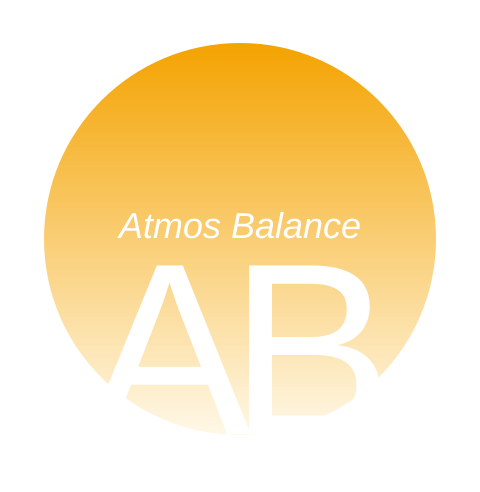

# AtmosBalance

  

**Know what you can spend — before you spend it.**

AtmosBalance is an iOS financial intelligence app built for HackRice 16. Instead of only showing a balance, AtmosBalance combines account activity, upcoming obligations, financial goals, and spending patterns to estimate what a user can safely spend and how a purchase may affect their future.

## Demo

**[Watch the full demo on YouTube](https://www.youtube.com/watch?v=VRIJ04JDxsk)**

## HackRice 16

- **Track:** Finance
- **Challenge:** Capital One Nessie
- **Platform:** iOS
- **Core technologies:** Swift, SwiftUI, Capital One Nessie API, Google Gemini

## What AtmosBalance does

- Aggregates financial account and transaction data
- Calculates **Available to Spend** after accounting for protected money and upcoming obligations
- Tracks financial **Goals** and estimates progress over time
- Shows forward-looking cash-flow and spending projections
- Lets users run **What If?** purchase and income scenarios before committing
- Explains the impact of hypothetical decisions on spending capacity and goals
- Uses qualitative transaction context such as necessity, flexibility, recurrence, and planning status
- Uses **Gemini** to interpret natural-language what-if scenarios and turn deterministic results into concise guidance
- Integrates **Capital One Nessie** as the banking-data provider for the hackathon challenge

## Running the app

### Requirements

- macOS
- Xcode with a recent iOS SDK
- An iPhone Simulator or compatible iOS device
- A Capital One Nessie API key for live Nessie data
- A Google Gemini API key for natural-language What If scenarios

### Setup

1. Clone this repository.
2. Open `Finanzas2026/Finanzas2026.xcodeproj` in Xcode.
3. Select the `Finanzas2026` scheme and an iPhone simulator.
4. Build and run the project.
5. To connect Nessie data, open the account connection flow inside the app and enter a valid Nessie API key and customer ID.
6. For Gemini-powered What If scenarios, open **What If → Ask Gemini** and paste your own Gemini API key. The key is stored only in the device Keychain and is never added to the project files.

The project also contains mock/demo data, so the interface and core financial logic can be explored without connecting a real bank account.

## How it works

AtmosBalance separates financial reasoning from AI-generated language. The financial engine performs the calculations that determine balances, protected funds, spending capacity, forecasts, and goal impact. Gemini does **not** decide whether a purchase is affordable; it interprets natural-language scenarios and explains results already produced by the deterministic financial engine.

Nessie is integrated through a provider layer that imports account and transaction information into the app's financial model. This lets the rest of the product reason over banking data without coupling the financial logic directly to the API implementation.

## Project structure

- `Finanzas2026/` — iOS application and SwiftUI interface
- `Sources/FinanceCore/` — banking integration and shared financial-domain logic
- `Sources/FinanceCore/Nessie/` — Capital One Nessie API client, mapping, and provider implementation
- `FinancialCore/` — financial calculations and forecasting logic
- `MockData/` — demo financial data
- `Tests/`, `TestTests/`, `TestUITests/` — automated test targets

## Security

API credentials are intentionally not required to be committed to the repository. Use your own development credentials when testing live integrations. Do not commit API keys, tokens, or other secrets.

## Team

Built during HackRice 16 by:

- Simon Velandia
- Carlos Gonzalez
- Lucas Chini Ferrari
- Marc Alcolea
